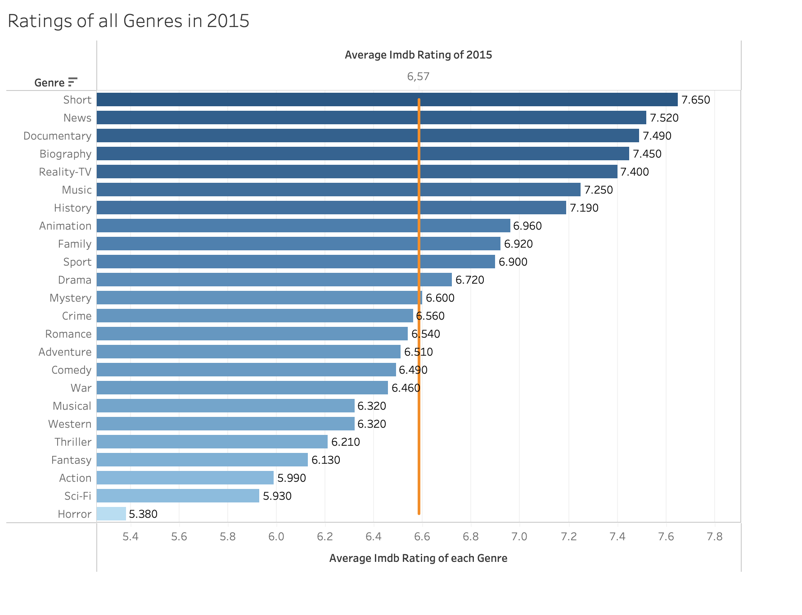

# Assignment 1: Working with Nested JSON Data

### Data sourse

I chose to work with **IMDB Movies Dataset** from Kaggle (94.24 MB): 
https://www.kaggle.com/datasets/mandeeplannister/imdb-movies-dataset

---

### Main task

I loaded, parsed and analyzed data in **DuckDB**. All of the SQL scripts and their short explanation can be found in data_engineering_assignment_1.sql file.

---

### Additional Task

For the additional task, I chose to create a visualisation.

I saved the results of my second analytical query and visualized them in Tableau. The visualisation shows the average IMDB ratings of all movie genres in 2015, in comparison to the average IMDB rating of that year.

